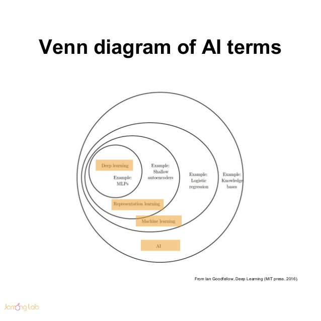
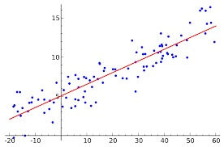

# Neural Networks!

#### Simple introduction to Machine Learning
#### Simple introduction to Neural Networks
#### Small digression on *biologically inspired* trends

HPC Tech Talk
June 2017

*Francesco Cremonesi*

---

## Machine Learning

> give computers the ability to learn without being explicitly programmed.
> Arthur Samuel, 1959

Applications everywhere:
- customer support (chatbots)
- dynamic pricing (ariline tickets)
- recommender systems (Amazon)
- self driving cars (Tesla)
- BBP ?

---

## From Machine Learning to Deep Learning

how I demystified the process and explain it to myself.

---

## From Regression To a Classification Problem

> Regression: predict y = f(x) when you don't know f, but you have a lot of (x,y) measurements.

Assumption: f is **linear**, i.e.
$$ y = Wx $$

Mathematical recipe:
1. assemble *all* the observations in a **design matrix** X;
2. **least-squares** approximation
$$ W = YX^T( XX^T )^{-1} ; $$

---

## From Regression To a Classification Problem

> New problem: predict *which class* x belongs to.

Recycle 

